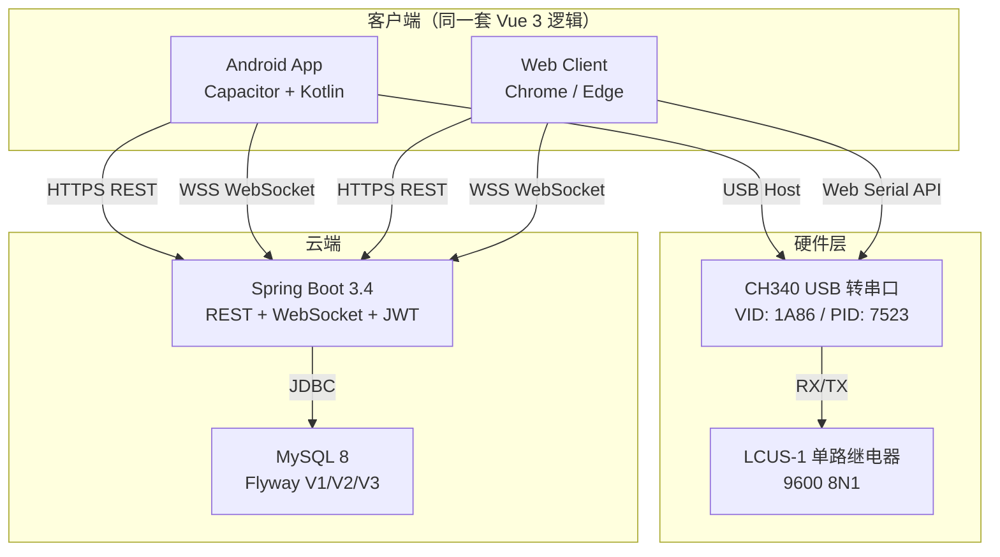
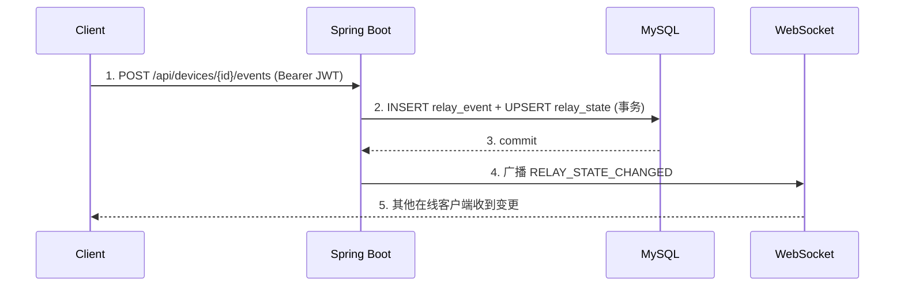

# USB Relay Cloud

一个支持 Android USB Host 与浏览器 Web Serial 的 USB 继电器云端控制与实时日志平台。

## 1. 项目简介

USB Relay Cloud 将本地 USB 继电器硬件接入云端，实现多客户端实时状态同步与操作日志审计。

- **Android App**：通过 USB Host + `usb-serial-for-android` 驱动 CH340 串口，控制 LCUS-1 继电器
- **Web Client**：Chrome / Edge 通过 Web Serial API 直接驱动 CH340 串口
- **Spring Boot**：REST 管理设备、状态和事件；WebSocket 实时广播变更
- **CH340 + LCUS-1**：已验证的硬件组合（VID `1A86` / PID `7523`，9600 8N1）
- **云端状态**：`relay_state` 记录每设备最新指令状态
- **实时 WebSocket**：多客户端实时同步，AUTH 帧鉴权 + sequence gap replay
- **操作日志**：`relay_event` append-only 审计日志
- **硬件事件日志**：`hardware_event` 独立记录 USB 插拔 / 连接 / 断开 / 失败

## 2. 当前版本

**V1 — Release Candidate**

测试状态：

| 项                            | 结果                    |
|------------------------------|-----------------------|
| Backend Maven test           | 27/27 passed ✅        |
| Backend Maven package        | BUILD SUCCESS ✅       |
| Frontend typecheck           | passed ✅              |
| Frontend Vitest              | 36/36 passed ✅        |
| Frontend Vite build          | passed ✅              |
| Android cap sync             | passed ✅              |
| Android Gradle assembleDebug | BUILD SUCCESSFUL ✅    |
| Flyway / MySQL 检查            | 待人工确认（本地 MySQL 密码不匹配） |
| Spring Boot 启动验证             | 待人工确认（依赖 MySQL）       |

## 3. 系统架构



事件闭环：



广播永远发生在数据库事务提交之后。

## 4. V1 工作模式

V1 使用同一套客户端业务逻辑，部署在不同平台：

| 平台                | 本地 USB 能力      | 工作模式            |
|-------------------|----------------|-----------------|
| Android App       | ✅ USB Host     | 可连接本地继电器 + 云端同步 |
| Web (Chrome/Edge) | ✅ Web Serial   | 可连接本地继电器 + 云端同步 |
| Web (其他浏览器)       | ❌ 无 Web Serial | 仅查看云端状态和日志      |

**V1 不是**：Server → Remote Device Agent 远程控制。远程控制属于 V2 Roadmap。

## 5. 硬件支持

| 项目      | 值             |
|---------|---------------|
| 继电器     | LCUS-1 单路     |
| USB 转串口 | CH340         |
| VID     | `1A86`        |
| PID     | `7523`        |
| 波特率     | 9600          |
| 数据位     | 8             |
| 停止位     | 1             |
| 校验      | NONE          |
| ON 指令   | `A0 01 01 A2` |
| OFF 指令  | `A0 01 00 A1` |
| 状态回读    | 无已验证协议        |

LCUS-1 没有经过验证的硬件状态回读协议。串口 write 成功只表示软件已写入命令，不代表实体触点已确认状态。因此数据模型始终区分：

- `commandedState`：`ON` / `OFF`（指令状态）
- `commandStatus`：`SUCCESS` / `FAILED`（执行结果）
- `hardwareState`：V1 固定为 `UNKNOWN`（不声称物理触点状态）

UI 使用 "Last Command" 展示，不会把写入成功显示成硬件确认。

## 6. 功能

- JWT 登录认证（BCrypt 哈希，无公开注册）
- 设备管理（ADMIN 可创建设备，设备自注册）
- 本地继电器控制（ON / OFF）
- HardwareProfile 自动匹配（VID/PID 优先，normalizeUsbId 标准化）
- 自动 USB 扫描与连接状态机（8 状态）
- 串口连接（Android USB Host / Web Serial / Electron 预留）
- command status（SUCCESS 才更新 relay_state，FAILED 不污染状态）
- WebSocket 实时同步（多客户端）
- eventId 幂等（重复提交返回 idempotentReplay=true）
- gap replay（断线重连后按 sequence 补发）
- SYNC_COMPLETE（补发完成通知）
- relay_event（append-only 操作日志）
- hardware_event（USB 插拔 / 连接 / 断开 / 失败日志）
- ACL（OWNER / CONTROL / VIEWER，ADMIN 全访问）
- 客户端 EventOutbox（本地待同步队列，自动重试 + 去重）
- 登录进度条（真实阶段驱动：验证 → 同步设备 → 建立连接）

## 7. 技术栈

### Backend

- Java 21
- Spring Boot 3.4.5
- Spring Security + JWT (jjwt 0.12.6)
- Spring WebSocket
- MyBatis-Plus 3.5.12
- MySQL 8
- Flyway
- Maven

### Frontend

- Vue 3 Composition API
- TypeScript
- Vite
- Pinia
- Vue Router
- Axios
- Vitest

### Android

- Capacitor 8
- Kotlin
- Android USB Host API
- `usb-serial-for-android`
- CH340 / LCUS-1 raw bytes

### Web Hardware

- Web Serial API（Chrome / Edge / secure context）

### Deployment

- Docker / Docker Compose
- Nginx
- Ubuntu 24.04（Native 部署）

## 8. 项目目录

```text
USB-Relay-Cloud/
├─ client/
│  ├─ src/
│  │  ├─ api/            # authApi, deviceApi, eventApi, hardwareEventApi, healthApi, http
│  │  ├─ components/      # ConnectionBadge, EventLogList, HardwareInfoPanel,
│  │  │                   # LocalRelayPanel, RelayControlPanel, StatePanel
│  │  ├─ config/          # authStorage, runtimeConfig
│  │  ├─ layouts/         # AppLayout
│  │  ├─ router/          # Vue Router
│  │  ├─ services/
│  │  │  ├─ relay/        # RelayService, EventOutbox, LocalRelayProvider,
│  │  │  │                # CloudRelayProvider, HardwareProfile, HardwareStatus
│  │  │  └─ websocket/    # RelayWebSocketClient, message parser
│  │  ├─ stores/          # authStore, connectionStore, deviceStore,
│  │  │                   # eventStore, hardwareEventStore, relayStore
│  │  ├─ types/           # api.ts
│  │  ├─ utils/           # format, id
│  │  └─ views/           # LoginView, DashboardView, DevicesView, LogsView, SettingsView
│  ├─ android/            # Capacitor Android 工程
│  ├─ electron/          # Electron 集成预留说明
│  ├─ public/
│  ├─ package.json
│  ├─ vite.config.ts
│  └─ tsconfig.json
├─ server/
│  ├─ src/main/java/com/absolutezero/usbrelaycloud/
│  │  ├─ common/          # ApiResponse, PageResponse, enums
│  │  ├─ config/          # Application, CORS, JWT, MybatisPlus, WebSocket, Bootstrap, Presence
│  │  ├─ controller/      # Auth, Device, Health
│  │  ├─ dto/             # Login, RelayCommand, RelayEventCreate, HardwareEventCreate, Heartbeat
│  │  ├─ entity/          # Device, DeviceUser, HardwareEvent, RelayEvent, RelayState, SysUser
│  │  ├─ exception/       # BusinessException, GlobalExceptionHandler, ResourceNotFound
│  │  ├─ mapper/          # MyBatis-Plus Mapper
│  │  ├─ security/        # AuthService, JwtService, SecurityConfig, JwtAuthenticationFilter, ...
│  │  ├─ service/         # DeviceService, RelayEventService, HardwareEventService, ...
│  │  ├─ vo/              # Response objects
│  │  └─ websocket/       # RelayWebSocketHandler, RelayWebSocketMessage
│  ├─ src/main/resources/
│  │  ├─ application.yml
│  │  ├─ application-dev.yml
│  │  ├─ application-prod.yml
│  │  └─ db/migration/   # V1, V2, V3
│  ├─ src/test/
│  └─ pom.xml
├─ deploy/
│  ├─ docker-compose.yml
│  ├─ .env.example
│  ├─ nginx/             # Docker Nginx 配置
│  ├─ native/            # Native Ubuntu 部署（systemd, nginx.conf, env.example）
│  └─ scripts/           # start.sh, stop.sh, verify-closed-loop.mjs
├─ docs/
│  ├─ architecture.md
│  ├─ api.md
│  ├─ database.md
│  ├─ deployment.md
│  └─ protocol.md
├─ .github/workflows/ci.yml
├─ LICENSE
└─ README.md
```

## 9. 本地开发

### 前置要求

- JDK 21
- Maven 3.9+
- Node.js 22+
- npm 10+
- MySQL 8

### Backend

复制部署环境并修改数据库密码（不要提交该文件）：

```bash
cp deploy/.env.example deploy/.env
# 编辑 deploy/.env 设置 MYSQL_ROOT_PASSWORD 等变量
```

如果不使用 Docker Compose，直接运行 Spring Boot：

```powershell
$env:DB_URL="jdbc:mysql://127.0.0.1:3306/usb_relay_cloud?useUnicode=true&characterEncoding=utf8&connectionTimeZone=UTC"
$env:DB_USERNAME="<YOUR_DB_USERNAME>"
$env:DB_PASSWORD="<YOUR_DB_PASSWORD>"
$env:SERVER_PORT="8080"
$env:JWT_SECRET="<YOUR_JWT_SECRET>"           # >= 32 chars
$env:APP_BOOTSTRAP_ADMIN_USERNAME="admin"
$env:APP_BOOTSTRAP_ADMIN_PASSWORD="<YOUR_ADMIN_PASSWORD>"
$env:APP_CORS_ALLOWED_ORIGINS="*"
cd server
mvn spring-boot:run
```

Health 检查：

```powershell
Invoke-RestMethod http://localhost:8080/api/health
```

### Frontend

```powershell
cd client
npm install
npm run dev -- --host 0.0.0.0
```

开发地址：`http://localhost:5173`

开发环境 API 和 WebSocket 地址在 `client/.env.development` 中配置。

### Android

```powershell
cd client
npm run build
npx cap sync android
cd android
.\gradlew.bat assembleDebug
```

APK 输出路径：

```text
client/android/app/build/outputs/apk/debug/app-debug.apk
```

## 10. 环境变量

| 变量                             | 说明                | 示例                                            |
|--------------------------------|-------------------|-----------------------------------------------|
| `DB_URL`                       | MySQL JDBC 连接串    | `jdbc:mysql://127.0.0.1:3306/usb_relay_cloud` |
| `DB_USERNAME`                  | 数据库用户名            | `<YOUR_DB_USERNAME>`                          |
| `DB_PASSWORD`                  | 数据库密码             | `<YOUR_DB_PASSWORD>`                          |
| `SERVER_PORT`                  | Spring Boot 端口    | `8080`                                        |
| `JWT_SECRET`                   | JWT 签名密钥（≥ 32 字符） | `<YOUR_JWT_SECRET>`                           |
| `APP_BOOTSTRAP_ADMIN_USERNAME` | 初始管理员用户名          | `admin`                                       |
| `APP_BOOTSTRAP_ADMIN_PASSWORD` | 初始管理员密码           | `<YOUR_ADMIN_PASSWORD>`                       |
| `APP_CORS_ALLOWED_ORIGINS`     | CORS 允许来源         | `*`（开发）                                       |
| `SPRING_PROFILES_ACTIVE`       | 激活配置              | `dev` / `prod`                                |

## 11. 数据库

Flyway migration 位于 `server/src/main/resources/db/migration/`。

| Migration                        | 内容                                   |
|----------------------------------|--------------------------------------|
| `V1__initialize_relay_cloud.sql` | `device`、`relay_state`、`relay_event` |
| `V2__add_authentication.sql`     | `sys_user`、`device_user`             |
| `V3__add_hardware_event.sql`     | `hardware_event`                     |

**严禁修改已执行的 migration。** 新需求只能新增 `V4__xxxx.sql`。

核心表：

| 表                | 说明                                    |
|------------------|---------------------------------------|
| `device`         | 设备注册                                  |
| `relay_state`    | 每设备最新指令状态（仅 SUCCESS 才 UPSERT）         |
| `relay_event`    | append-only 事件审计日志（eventId 幂等）        |
| `sys_user`       | 系统用户（global_role: ADMIN / USER）       |
| `device_user`    | 设备级授权（role: OWNER / CONTROL / VIEWER） |
| `hardware_event` | 硬件生命周期事件（USB 插拔 / 连接 / 断开 / 失败）       |

详细字段和索引见 [docs/database.md](docs/database.md)。

`relay_event` 是 append-only 审计表，正常业务不 UPDATE、不 DELETE。
`relay_state` 的 `lastEventId` / `commandedState` / `commandStatus` 仅在事件 `commandStatus = SUCCESS` 时更新；FAILED
事件不污染状态。

## 12. 安全语义

- **CONNECTED 才能控制**：USB 硬件未进入 CONNECTED 状态时，UI 开关 disabled
- **无 optimistic update**：先执行本地 USB write，成功后才更新状态
- **write success 才产生 SUCCESS**：串口写入失败 → FAILED，不更新 relay_state
- **FAILED 不改变 relay_state**：失败事件只记录日志，不污染状态
- **USB 拔出不等于 OFF**：拔出只写 hardware_event，不伪造 relay OFF
- **LCUS-1 无状态回读**：不声称物理触点状态，`hardwareState` 始终为 UNKNOWN
- **WebSocket AUTH 帧强制**：连接后 5 秒内必须发送 AUTH 帧，否则关闭
- **JWT_SECRET ≥ 32 字符**：生产环境必须设置，dev profile 有默认值仅供本地
- **管理员账号**：首次启动 `sys_user` 为空时通过环境变量创建（BCrypt 哈希）
- **Spring Boot / MySQL 不暴露公网**：Native 部署仅监听 127.0.0.1，外部通过 Nginx

## 13. Web Serial

Web Serial API 需要：

- Chrome / Edge 浏览器
- HTTPS secure context（或 `localhost` 开发例外）

局域网 HTTP（如 `http://192.168.x.x:5173`）可能无法使用 Web Serial。这是浏览器安全限制，不是程序 Bug。

## 14. 测试

### Backend

```powershell
cd server
mvn clean test          # 27 tests
mvn clean package       # BUILD SUCCESS, JAR: server/target/usb-relay-cloud-server-0.1.0-SNAPSHOT.jar
```

### Frontend

```powershell
cd client
npm run typecheck       # vue-tsc --noEmit
npm test -- --run       # 36 tests
npm run build           # vite build
```

### Android

```powershell
cd client
npx cap sync android
cd android
.\gradlew.bat clean assembleDebug    # BUILD SUCCESSFUL
```

### 闭环验证

```powershell
# 需要 Server 和 MySQL 已启动
node deploy/scripts/verify-closed-loop.mjs
```

脚本覆盖：login → 401 → WS AUTH → POST → 幂等 → 实时广播 → gap replay。

## 15. Production Deployment

V1 支持两套等价的生产部署方案。两套方案都遵守同样的安全约束：对外只开放 Nginx 端口，Spring Boot 8080 与 MySQL 3306 不暴露公网。

### Part A — Docker Compose（推荐）

```text
Internet
  -> Host:8088 -> Nginx:80
     -> /api/ -> Spring Boot:8080 (Docker 内网)
     -> /ws/  -> Spring Boot:8080 (Docker 内网)
     -> /     -> Vue static files
  -> MySQL:3306 (Docker 内网，不暴露)
```

```bash
cd deploy
cp .env.example .env
chmod 600 .env
# 编辑 .env 设置 JWT_SECRET, ADMIN 密码等
sh scripts/start.sh
```

### Part B — Native Ubuntu（无 Docker）

```text
Internet
  -> :80 (或 :443 + TLS) -> Nginx (Host)
     -> /api/ proxy_pass http://127.0.0.1:8080
     -> /ws/  proxy_pass http://127.0.0.1:8080 (WebSocket Upgrade)
     -> /     -> /var/www/usb-relay-cloud (Vue dist)
  -> systemd -> java -jar (127.0.0.1:8080，非 root)
  -> mysql.service (127.0.0.1:3306)
```

部署文件位于 `deploy/native/`：

| 文件                            | 安装位置                                         | 用途                          |
|-------------------------------|----------------------------------------------|-----------------------------|
| `usb-relay-cloud.service`     | `/etc/systemd/system/`                       | systemd 服务                  |
| `usb-relay-cloud.env.example` | `/etc/usb-relay-cloud/usb-relay-cloud.env`   | Spring Boot 敏感配置（chmod 600） |
| `nginx.conf`                  | `/etc/nginx/sites-available/usb-relay-cloud` | Nginx 反代 + WebSocket        |

详细 Ubuntu 24.04 部署流程见 [docs/deployment.md](docs/deployment.md)。

## 16. V1 Limitations

- 当前主要为单 admin 使用模式
- V1 尚未实现正式多用户注册管理
- 无远程 Device Agent command（Cloud-to-Device 远程控制未实现）
- LCUS-1 无硬件状态回读，`hardwareState` 始终为 UNKNOWN
- Web Serial 受浏览器 secure context 限制（局域网 HTTP 不可用）
- Android App 没有后台常驻、开机启动或 Foreground Service

## 17. V2 Roadmap

以下仅为 Roadmap，V1 未实现：

- 多账号、用户注册 / 管理
- RBAC 细粒度权限
- Device ACL 管理 UI
- Device Agent（远程设备代理）
- Remote Command（远程下发控制）
- `relay_command` 表 + command ACK
- Audit Log（actor / executor 审计）
- Admin Console
- Refresh Token

## 18. License

MIT License — 见 [LICENSE](LICENSE)。

Copyright (c) 2026 AbsoluteZero
